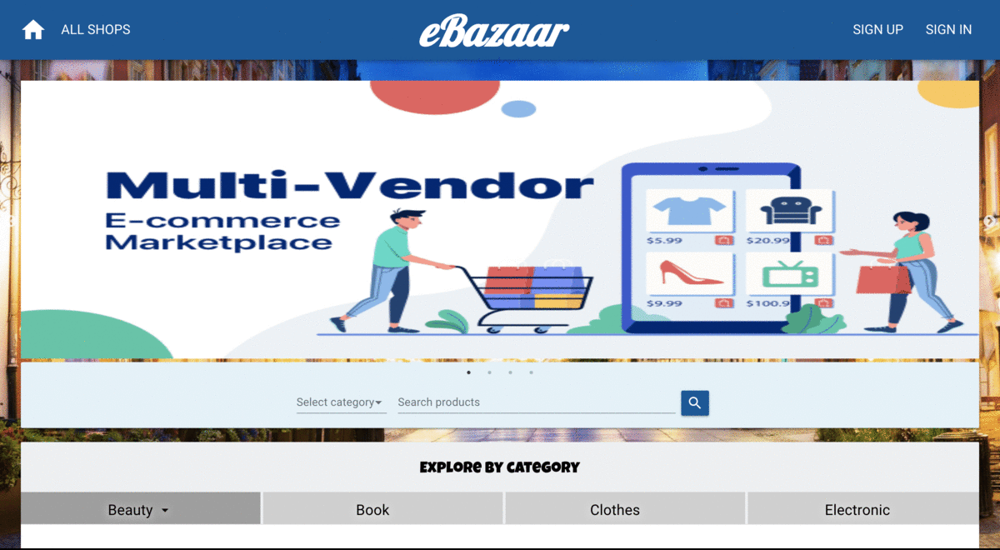

# eBazaar

Welcome to eBazaar! eBazaar is a platform for multi-vendor marketplace which is like - Amazon, eBay, and Craigslist. A multi-vendor marketplace refers to an online marketplace business were more than a single buyer and seller initiate or conduct transactions. It acts as a digital middleman that connects both buyers and sellers at a common platform, making it convenient for them to find each other, scale their business, and manage it efficiently.

Features:
- User Profiles for both buyer and seller
- Product Search across multiple fields
- Frontend listing creation and browsing
- Seller Storefront
- Geolocalization for users and listings


## Getting Started
Click <a href="https://e---bazaar.herokuapp.com/">here</a> to start!

## Screen Shots



## Technologies used
- Node.js
- React - https://www.npmjs.com/package/react
- Express - https://www.npmjs.com/package/express
- NPM - https://www.npmjs.com/package/npm or Yarn - https://www.npmjs.com/package/yarn
- MongoDB - https://www.mongodb.com/
- Material-UI - https://material-ui.com/
- Json Web Tokens - https://jwt.io/

## Using the Application Locally
1. Make sure MongoDB is running on your system
2. Clone this repository
3. Open command line in the cloned folder,
    ```
    - To install dependencies, run npm install or yarn
    - To run the application for development, run npm run development or yarn development
    ```
4. Open localhost:5000 in the browser
5. Enjoy!
